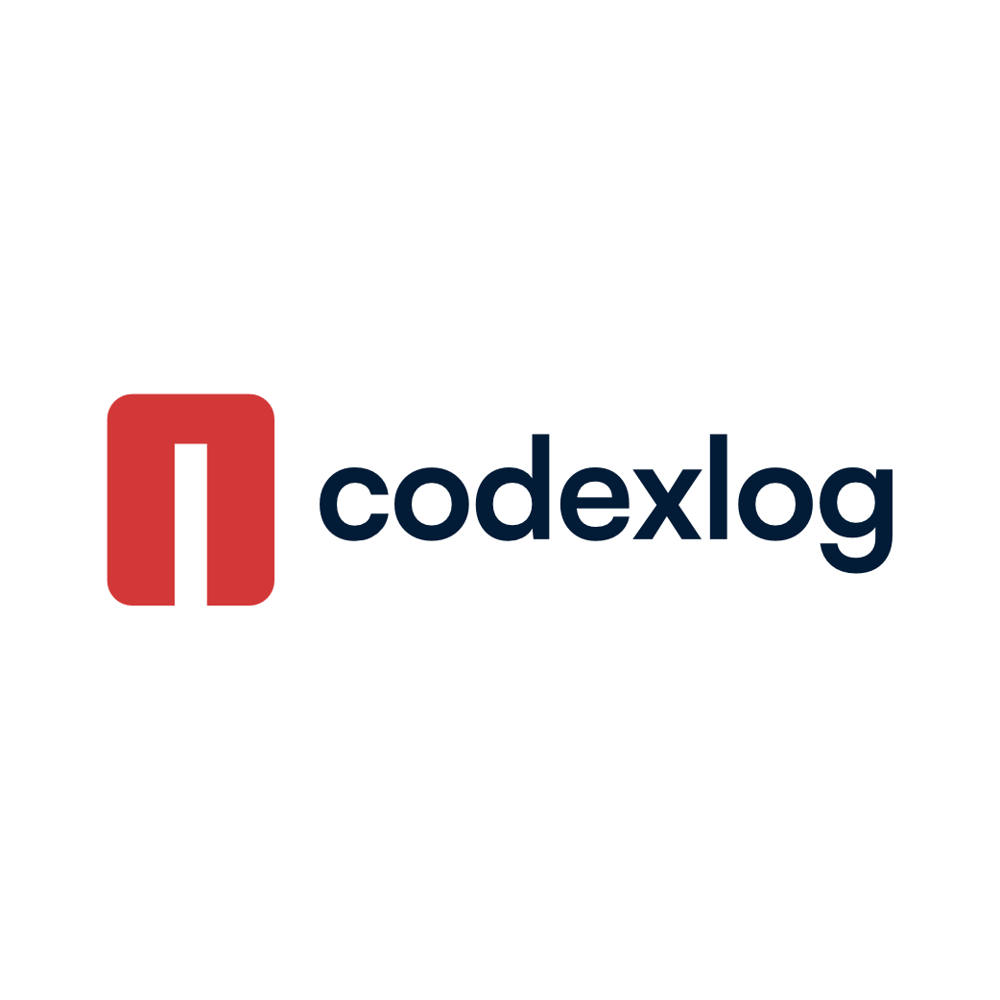

# Offizielle Wortmarke: codexlog

## Schreibweise

Die offizielle, einheitliche Schreibweise der Marke ist:

**codexlog** (komplett in Kleinbuchstaben)

Diese Form wird in allen Kontexten verwendet – sowohl intern (Code, Dokumentation, UI) als auch extern (Marketing, Website, Impressum).

## Konventionen nach Bereich

- **Projektname / Marke:** `codexlog`  
  _Beispiel:_ „Das ist das Dashboard von codexlog“

- **UI / App-Titel:** `codexlog`  
  _Beispiel:_ Header, Sidebar, Login-Modal

- **Text & Dokumentation:** `codexlog`  
  _Beispiel:_ Readme, Styleguide, Sicherheitskonzept

- **Domains / URLs / Repos:** `codexlog`  
  _Beispiel:_ `https://codexlog.com`

- **Code / Variablen:** `codexlog`  
  _Beispiel:_ `codexlog_api`, `codexlog_user`

## Hintergrund

Die bewusste Kleinschreibung unterstreicht:

- minimalistisches Branding  
- moderne, reduzierte Formsprache  
- optische Einheit mit dem Logo

## Logo-Referenz

---

# Official Wordmark: codexlog

## Spelling

The official and consistent spelling of the brand is:

**codexlog** (entirely in lowercase)

This form is used in all contexts – internally (code, documentation, UI) and externally (marketing, website, legal).

## Conventions by Context

- **Project name / Brand:** `codexlog`  
  _Example:_ “This is the dashboard of codexlog”

- **UI / App title:** `codexlog`  
  _Example:_ Header, sidebar, login modal

- **Text & documentation:** `codexlog`  
  _Example:_ README, style guide, security concept

- **Domains / URLs / Repositories:** `codexlog`  
  _Example:_ `https://codexlog.com`

- **Code / Variables:** `codexlog`  
  _Example:_ `codexlog_api`, `codexlog_user`

## Background

The deliberate lowercase spelling emphasizes:

- minimalist branding  
- modern, reduced design language  
- visual unity with the logo

## Logo reference

---

Diese Datei ist Bestandteil des Repos und wird im Projektverzeichnis `/docs/branding/wordmark.md` abgelegt.  
This file is part of the repository and is located in the project directory at `/docs/branding/wordmark.md`.
